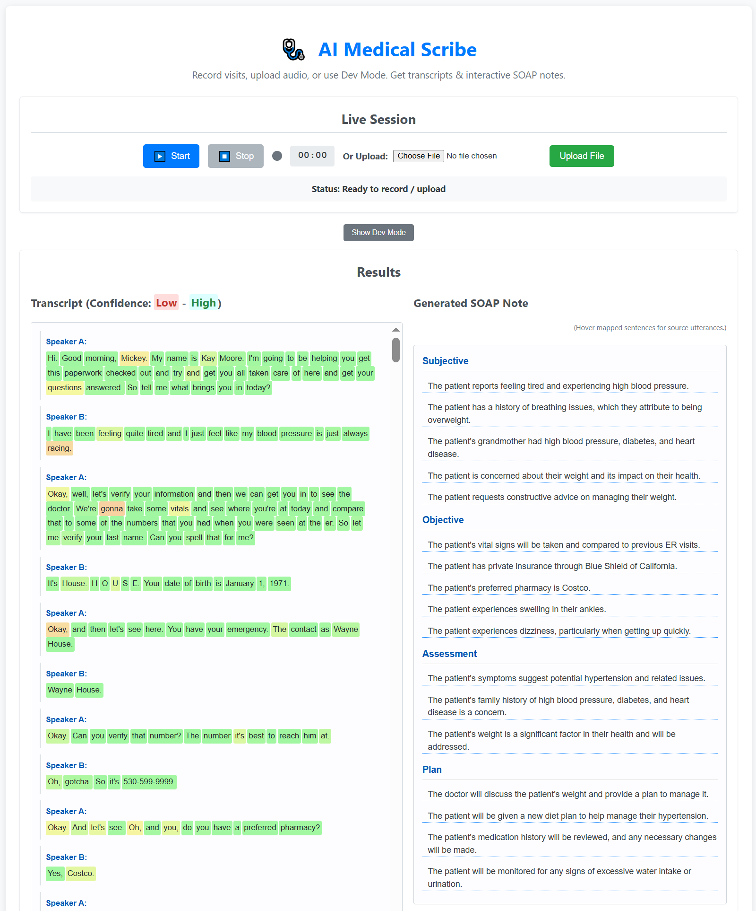
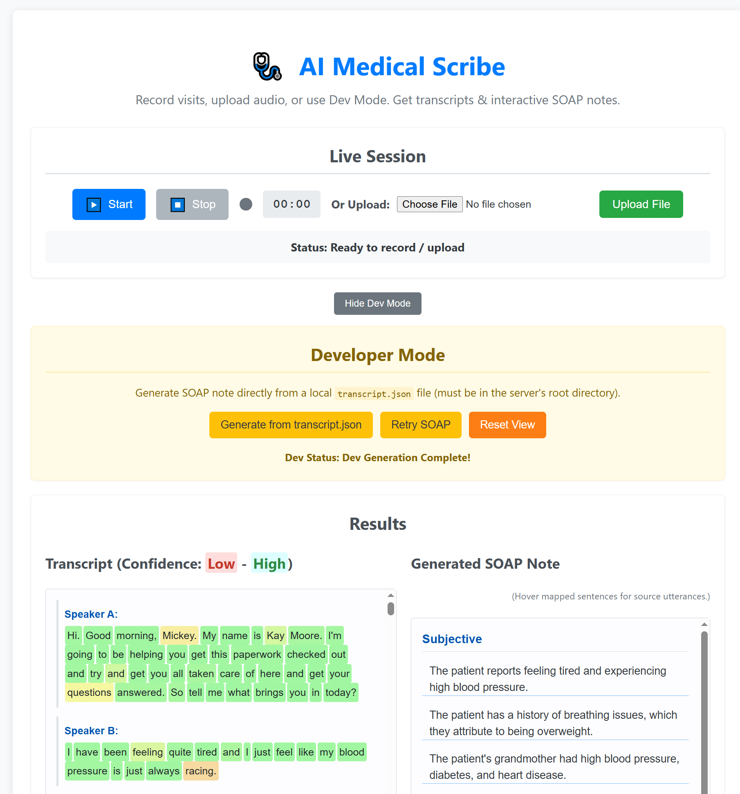
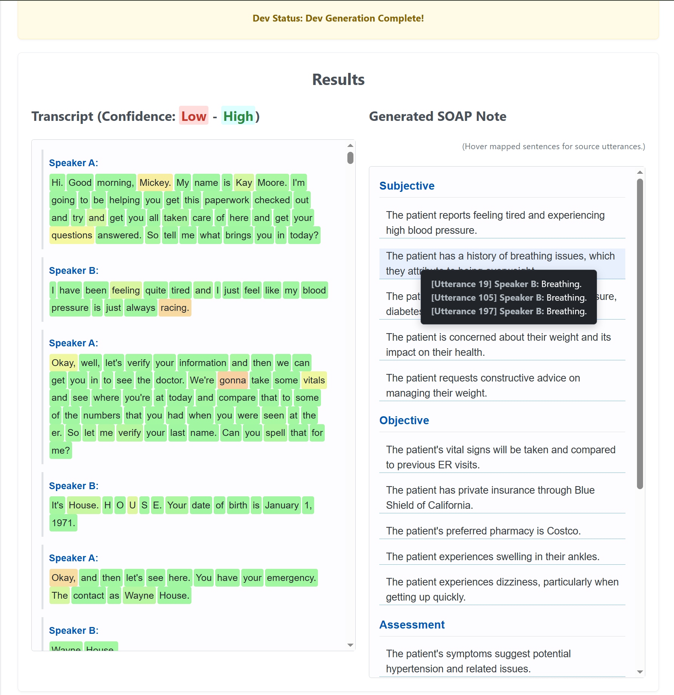

# AI Medical Scribe Web App

This web application provides a platform to record or upload patient visit audio, transcribe it using AssemblyAI, and generate structured clinical SOAP notes (Subjective, Objective, Assessment, Plan) using the Groq API for fast LLM inference.

The application features real-time status updates via WebSockets, interactive transcript display with confidence scores, and an interactive SOAP note display where hovering over mapped sentences reveals the source utterance(s) from the transcript in a dialog box. It also includes a Developer Mode for testing SOAP note generation directly from a local transcript file.

**Note:** This version uses **in-memory storage** (job progress is lost on server restart) and **polls** AssemblyAI for transcription status. It's suitable for demonstration and development but would require modifications (database integration, webhooks) for production use.

## Screenshots
### 
### 
### 

## Key Features

* **Audio Recording:** Record audio directly in the browser using the MediaRecorder API.
* **Audio File Upload:** Upload existing audio files (e.g., WAV, MP3, M4A - check AssemblyAI supported formats).
* **Recording Timer:** Displays elapsed time during recording.
* **Real-time Status Updates:** Uses WebSockets (Socket.IO) for immediate feedback on the process (Uploading, Transcribing, Generating SOAP, etc.).
* **Transcription:** Utilizes AssemblyAI's asynchronous transcription API (via polling).
* **Speaker Diarization:** Attempts to identify different speakers in the transcript (if enabled and audio quality allows).
* **SOAP Note Generation:** Leverages the Groq API (with models like Llama 3 70B) to generate structured SOAP notes in JSON format based on the transcript.
* **Interactive Transcript Display:** Shows the transcript, potentially highlighting words by confidence score (visualizes AssemblyAI's confidence).
* **Interactive SOAP Note Display:**
    * Renders the generated SOAP note with clear sections (Subjective, Objective, Assessment, Plan).
    * **Mapping:** Hovering over sentences in the SOAP note displays a floating dialog containing the original transcript utterance(s) they were derived from.
* **Developer Mode:**
    * Allows bypassing recording/upload/transcription.
    * Generates SOAP notes directly from a predefined `transcript.json` file located on the server.
    * Includes options to Retry generation or Reset the UI view.
    * **Default State:** The application now loads in Dev Mode by default, attempting to process `transcript.json` on startup.

## Tech Stack

* **Backend:** Node.js, Express.js
* **Real-time Communication:** Socket.IO
* **Audio Upload:** Multer
* **API Calls:** Axios (AssemblyAI), node-fetch (Groq)
* **Transcription:** AssemblyAI Asynchronous API (via Polling)
* **SOAP Note Generation:** Groq API
* **Environment Variables:** dotenv
* **Frontend:** HTML, CSS, Vanilla JavaScript (MediaRecorder, Fetch API, Socket.IO Client, Marked.js for potential Markdown rendering)

## Setup

### Prerequisites

* Node.js (LTS version recommended, e.g., v18+ or v20+)
* npm (usually included with Node.js)

### Installation

1.  **Clone the repository:**
    ```bash
    git clone https://github.com/triggeredcode/ai-medical-soap-notes-generator.git
    cd ai-medical-soap-notes-generator
    ```
2.  **Install dependencies:**
    ```bash
    npm install
    ```
3.  **Configure Environment Variables:**
    * Create a file named `.env` in the project root directory.
    * Add your API keys:
        ```dotenv
        # .env file content
        ASSEMBLYAI_API_KEY=your_assemblyai_api_key_here
        GROQ_API_KEY=your_groq_api_key_here
        # PORT=3000 # Optional: Define a custom port
        ```
    * Get keys from:
        * AssemblyAI: [https://www.assemblyai.com/](https://www.assemblyai.com/)
        * Groq: [https://console.groq.com/keys](https://console.groq.com/keys)

4.  **Prepare for Dev Mode (Optional but Recommended):**
    * Create a file named `transcript.json` in the project root directory (the same directory as `server.js`).
    * This file should contain a valid JSON object mimicking the structure returned by the AssemblyAI `/transcript/{id}` endpoint (status "completed"), specifically requiring at least an `utterances` array.
    * **Example `transcript.json` structure:**
        ```json
        {
          "id": "dev-mode-transcript-123",
          "status": "completed",
          "audio_url": "local_file",
          "utterances": [
            { "speaker": "A", "text": "Hello Doctor, I've been feeling quite tired lately and my blood pressure seems high.", "start": 500, "end": 5500, "confidence": 0.98, "words": [] },
            { "speaker": "B", "text": "Okay, tell me more. Any other symptoms?", "start": 6000, "end": 9000, "confidence": 0.99, "words": [] },
            { "speaker": "A", "text": "Sometimes I get dizzy when I stand up too fast.", "start": 9500, "end": 13000, "confidence": 0.95, "words": [] }
          ],
          "words": [
             {"text": "Hello", "start": 500, "end": 800, "confidence": 0.99, "speaker": "A"},
             {"text": "Doctor,", "start": 900, "end": 1300, "confidence": 0.99, "speaker": "A"},
             // ... more words if your transcript display uses them ...
          ]
          // Include other relevant fields if needed by your frontend logic
        }
        ```

## Running the Application

1.  **Start the server:**
    ```bash
    node server.js
    ```
    *(Alternatively, if you install `nodemon` (`npm install --save-dev nodemon`), you can add `"dev": "nodemon server.js"` to your `package.json` scripts and run `npm run dev` for auto-restarting on changes.)*

2.  **Access the application:** Open your web browser and navigate to `http://localhost:3000` (or the port you specified).

## How to Use

1.  **Initial Load (Dev Mode):**
    * The application starts in Dev Mode.
    * It automatically attempts to read `transcript.json` from the server root and generate a SOAP note. The results will be displayed if successful.
    * Use "Retry SOAP" to regenerate the note from the *same* `transcript.json`.
    * Use "Reset View" to clear the transcript and SOAP note display areas.
    * Click "Hide Dev Mode" to switch to Normal Mode.

2.  **Normal Mode (Recording/Upload):**
    * If Dev Mode is hidden, you can record or upload audio.
    * **Recording:** Click "Start", speak into your microphone (grant permission if prompted), observe the timer. Click "Stop" when finished.
    * **Uploading:** Click "Choose File", select an audio file from your computer, then click "Upload File".
    * **Processing:** Observe the status updates as the audio is uploaded, transcribed by AssemblyAI, and the SOAP note is generated by Groq.
    * **Results:** The transcript and SOAP note will appear once processing is complete.
    * **Interaction:** Hover over sentences in the SOAP note that have a dotted underline. A dialog box will appear showing the source utterance(s) from the transcript.

3.  **Switching Modes:** Use the "Show/Hide Dev Mode" button to toggle between modes.

## Limitations and Future Work

* **In-Memory Storage:** Job status and results are lost when the server restarts. Implement a database (e.g., MongoDB, PostgreSQL) for persistence.
* **AssemblyAI Polling:** Polling is less efficient than using AssemblyAI's Webhooks for transcription completion notifications.
* **Error Handling:** Error handling can be made more robust and user-friendly.
* **Mapping Accuracy:** The quality of the SOAP note mapping depends heavily on the LLM's ability to correctly identify source utterances.
* **Scalability:** The current setup runs as a single Node.js process. Consider horizontal scaling strategies for higher loads.
* **Security:** Basic setup; add appropriate security measures for production (input validation, rate limiting, authentication if needed).
* **Saving Transcripts:** Currently, transcripts from recordings/uploads are not saved back to `transcript.json`. This could be added.
